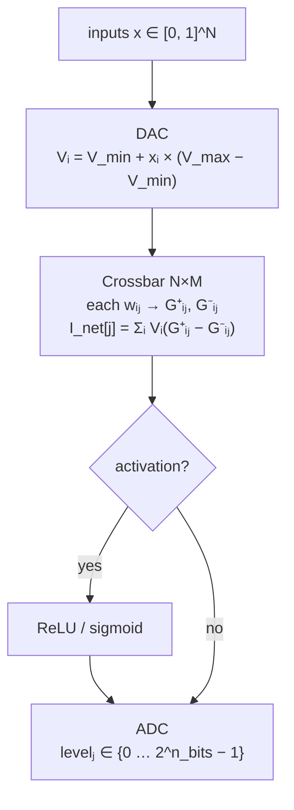
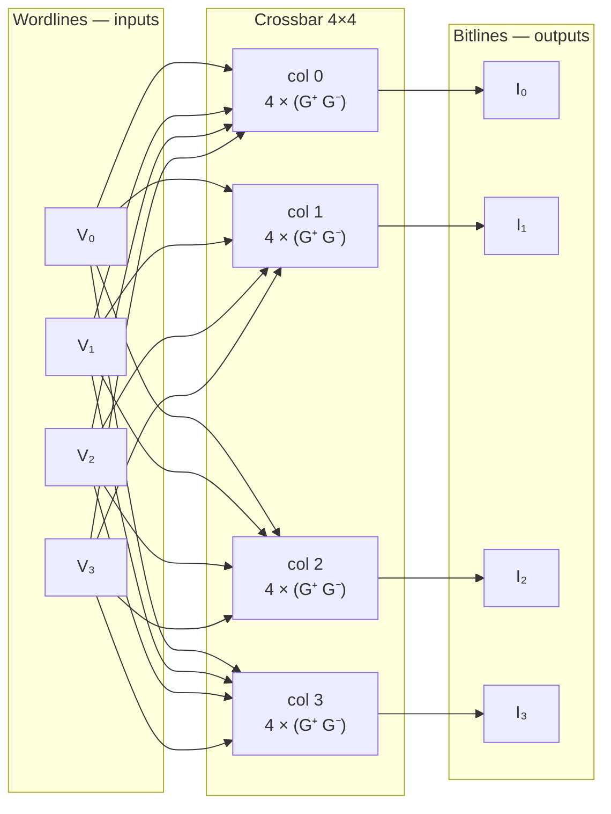
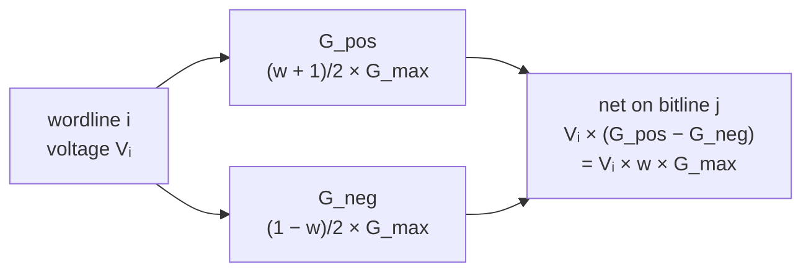
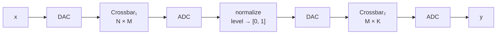
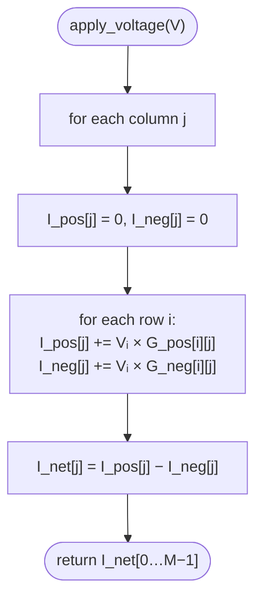

# VOLT — Virtual Ohmic Logic Testbench

<p align="center">
  <a href="https://github.com/hocestnonsatis/virtual-ohmic-logic-testbench/releases/latest"></a>
  &nbsp;
  <a href="https://github.com/hocestnonsatis/virtual-ohmic-logic-testbench/actions/workflows/cargo.yml"></a>
  &nbsp;
  <a href="https://github.com/hocestnonsatis/virtual-ohmic-logic-testbench/blob/main/LICENSE"></a>
  &nbsp;
  
</p>

<p align="center">
  <sub>Tree version <code>0.2.0</code> · Tag a release as <code>v0.2.0</code> to publish binaries via GitHub Actions · <a href="#releases--downloads">Downloads</a></sub>
</p>

Software physics simulator for **Analog In-Memory Computing (AIMC)** crossbar arrays. VOLT models voltage-based neural inference with Ohm’s law and Kirchhoff’s current law—useful for exploring feasibility before hardware exists.

**Stack:** Rust (edition 2021), Cargo. Core uses `clap`, `rand`, `serde_json`; optional Python bindings via PyO3/maturin.

---

## Contents

1. [Concept](#concept) — digital operations vs. simulated analog  
2. [How the crossbar works](#how-the-crossbar-works) — pipeline + physical layout (ASCII & Mermaid)  
3. [Quick start](#quick-start) — build, run, tests  
4. [Releases & downloads](#releases--downloads) — prebuilt `volt`, versioning  
5. [Repository layout](#repository-layout)  
6. [Design notes](#design-notes) — differential pair, bipolar ADC, read disturb, activations, endurance  
7. [Scenarios & results](#scenarios--results)  
8. [Defaults (`volt-core` config)](#defaults-volt-core-config)  
9. [Project rules](#project-rules)  
10. [Roadmap](#roadmap)

---

## Concept

| Digital idea | Analog stand-in | Formula |
|--------------|-----------------|---------|
| Input token | Voltage `V` | `V = V_min + input × (V_max − V_min)` |
| Weight | Conductance `G` | `G = f(w)` via differential pair |
| Multiply | Ohm’s law | `I = V × G` |
| Dot product | Kirchhoff (current sum) | `I_total = Σ (Vᵢ × Gᵢ)` |
| Output | ADC | `level = floor((I − I_min) / I_step)` |

---

## How the crossbar works

VOLT simulates one **matrix–vector multiply** (MAC) per forward pass. Digital inputs become row voltages; each crosspoint is a pair of non-negative conductances; column bitlines sum currents (Kirchhoff); the ADC turns each column current into a digital code.

### End-to-end pipeline



<details>
<summary>ASCII version (plain-text / copy-paste)</summary>

```
  inputs x[0…N−1]  in [0, 1]
         │
         ▼
    ┌─────────┐
    │   DAC   │   V_i = V_min + x_i × (V_max − V_min)
    └────┬────┘
         │  wordline voltages  V_0 … V_{N−1}
         ▼
    ┌──────────────────────────────────────────┐
    │  CROSSBAR  N rows × M cols               │
    │  weight w[i][j] → two cells: G⁺, G⁻      │
    │  column j: sum currents on bitline j     │
    └────────────────────┬─────────────────────┘
                         │  I_net[j] = Σ_i V_i × (G⁺ᵢⱼ − G⁻ᵢⱼ)
                         ▼
              (optional ReLU / sigmoid on I_net)
                         │
                         ▼
    ┌─────────┐
    │   ADC   │   level_j ∈ {0 … 2^n_bits − 1}
    └─────────┘
```

</details>

This is the linear layer `y = W × x` in analog form: each output column `j` is one dot product `Σᵢ w[i][j] × x[i]`, with `x` encoded as voltage and `w` encoded as conductance difference.

### Physical layout (4×4 example)

Rows are **wordlines** (one applied voltage per input). Columns are **bitlines** (one summed current per output). Every matrix entry uses **two** RRAM cells so signed weights stay physical (`G ≥ 0`):



Each bitline sums Ohmic currents from every row in that column:

`I_j = Σᵢ Vᵢ × G⁺ᵢⱼ − Σᵢ Vᵢ × G⁻ᵢⱼ = Σᵢ Vᵢ × w[i][j] × G_max`

<details>
<summary>ASCII grid (plain-text / copy-paste)</summary>

```
  bitlines (outputs)  →  I_0    I_1    I_2    I_3
                        │      │      │      │
         col0      col1      col2      col3
      ┌───────┬───────┬───────┬───────┐
  V_0 │ G⁺ G⁻ │ G⁺ G⁻ │ G⁺ G⁻ │ G⁺ G⁻ │  wordline 0
      ├───────┼───────┼───────┼───────┤
  V_1 │ G⁺ G⁻ │ G⁺ G⁻ │ G⁺ G⁻ │ G⁺ G⁻ │  wordline 1
      ├───────┼───────┼───────┼───────┤
  V_2 │ G⁺ G⁻ │ G⁺ G⁻ │ G⁺ G⁻ │ G⁺ G⁻ │  wordline 2
      ├───────┼───────┼───────┼───────┤
  V_3 │ G⁺ G⁻ │ G⁺ G⁻ │ G⁺ G⁻ │ G⁺ G⁻ │  wordline 3
      └───────┴───────┴───────┴───────┘

  I_j = Σ_i  V_i × G⁺ᵢⱼ  −  Σ_i  V_i × G⁻ᵢⱼ     (Kirchhoff on bitline j)
      = Σ_i  V_i × w[i][j] × G_max                 (differential pair)
```

</details>

### One crosspoint (differential pair)

A single signed weight `w ∈ [-1, 1]` at row `i`, column `j`:



<details>
<summary>ASCII version (plain-text / copy-paste)</summary>

```
  wordline i  ─── V_i ───┬──[ G_pos ]──┐
                         │              ├──► bitline j
                         └──[ G_neg ]──┘

  G_pos = (w + 1) / 2 × G_max
  G_neg = (1 − w) / 2 × G_max

  contribution to I_j  =  V_i × (G_pos − G_neg)  =  V_i × w × G_max
```

</details>

`w = +1` → only `G_pos` is full scale; `w = −1` → only `G_neg`; `w = 0` → equal pair, zero net current at that crosspoint.

### Multi-layer (scenario F)

Layer 1 ADC codes are mapped back to `[0, 1]` and fed into layer 2’s DAC — same crossbar physics, chained:



Default demo: `N = M = K = 4`. With `--weights` / `--weights2`, dimensions follow your CSV matrices.

<details>
<summary>ASCII version (plain-text / copy-paste)</summary>

```
  x ──► DAC ──► Crossbar₁ (N×M) ──► ADC ──► normalize ──► DAC ──► Crossbar₂ (M×K) ──► ADC ──► y
```

</details>

### What happens inside `apply_voltage`

For each column `j`, VOLT walks all rows and accumulates:



<details>
<summary>ASCII / pseudocode (plain-text / copy-paste)</summary>

```
I_pos[j] += V_i × G_pos[i][j]
I_neg[j] += V_i × G_neg[i][j]
I_net[j]  = I_pos[j] − I_neg[j]
```

</details>

Optional physics (scenarios C–E, I) can alter `G_pos` / `G_neg` before or during this step: thermal noise, read disturb on neighbor rows, write-endurance scaling. The math above is unchanged — only the conductances drift.

---

## Quick start

**Requirements:** Rust toolchain (stable); [rustup](https://rustup.rs/) recommended.

```bash
cargo build --release
```

Run the simulator (writes `results.csv` in the current directory):

```bash
cargo run --release -p volt-cli
# or after build:
./target/release/volt
```

**Benchmark mode** (matrix size sweep, ~40 ms per size; writes `benchmark.csv`):

```bash
cargo run --release -p volt-cli -- --benchmark
```

**Physics JSON** (optional; merged onto defaults for all scenarios and for `--benchmark`):

```bash
cargo run --release -p volt-cli -- --config volt.example.json
```

**Weight matrix CSV** (optional **N×M**, N ≤ 512 and M ≤ 512; comma-separated rows):

```bash
cargo run --release -p volt-cli -- --weights volt.example.weights.csv
```

**Inputs CSV** (optional; **N** values in `[0,1]` for the DAC — one line and/or one number per line). If you omit `--inputs` after `--weights`, a built-in ramp vector is used; with the built-in 4×4 demo (no `--weights`), the original demo input is kept.

```bash
cargo run --release -p volt-cli -- --weights volt.example.weights.csv --inputs volt.example.inputs.csv
```

**Second layer (scenario F)** — optional **`--weights2`** matrix for layer-2; default is **0.5×I** with size **M×M** so currents stay easier to bound.

Run tests:

```bash
cargo test --workspace
```

---

## Releases & downloads

| | |
|:--|:--|
| **Latest** | [](https://github.com/hocestnonsatis/virtual-ohmic-logic-testbench/releases/latest) |
| **Version file** | [`VERSION`](VERSION) (current `0.2.0`) |

Pushing a git tag matching `v*.*.*` (for example `v0.2.0`) runs [`.github/workflows/release.yml`](.github/workflows/release.yml): **Linux**, **Windows**, and **macOS** archives built with Cargo. Each archive contains the `volt` binary (`volt.exe` on Windows), `README.md`, `VERSION`, and `LICENSE`.

| Platform | Asset name pattern |
|----------|-------------------|
| Linux x86_64 | `volt-<tag>-linux-x86_64.tar.gz` |
| Windows x64 | `volt-<tag>-windows-x64.zip` |
| macOS | `volt-<tag>-macos.tar.gz` |

After extracting, run `./volt` from the inner folder (Linux/macOS) or `volt.exe` (Windows). CI status for every push/PR: [](https://github.com/hocestnonsatis/virtual-ohmic-logic-testbench/actions/workflows/cargo.yml).

---

## Repository layout

```
.
├── VERSION                 # Semver string for releases (e.g. 0.2.0)
├── LICENSE                 # MIT
├── Cargo.toml              # Workspace root
├── volt.example.json       # Example `--config` (subset of fields)
├── volt.example.weights.csv # Example `--weights` (4×4)
├── volt.example.inputs.csv  # Example `--inputs` (length 4)
├── crates/
│   ├── volt-core/          # Simulation library (incl. weight_norm, weights_csv)
│   ├── volt-cli/           # `volt` binary (scenarios A–K)
│   └── volt-py/            # PyO3 Python module
├── python/
│   ├── smoke_test.py       # Optional Python bindings smoke test
│   ├── gguf_to_volt.py     # GGUF tensor → VOLT weights CSV
│   └── test_gguf_to_volt.py # GGUF import integration test
├── docs/superpowers/plans/ # Implementation plans
├── pyproject.toml          # maturin build for volt-py
└── .github/workflows/
    ├── cargo.yml           # CI: build + test + CLI smoke
    ├── python-bindings.yml # maturin + smoke_test + GGUF import test
    └── release.yml         # Tag v*.*.* → Release binaries
```

---

## Design notes

### Differential pair (signed weights)

Conductance is physical: `G ≥ 0`. Signed weights use two cells per effective weight:

```
G_pos[i][j] = (w + 1) / 2 × G_max
G_neg[i][j] = (1 − w) / 2 × G_max
I_net       = (G_pos − G_neg) × V = w × G_max × V
```

This keeps weights in `[-1, 1]` while respecting `G ≥ 0`.

### Bipolar ADC window

`I_net` can be negative. The ADC maps the full signed current range `[I_min, I_min + I_range]` to digital codes:

```
I_step = I_range / (2^n_bits − 1)
level  = clamp(floor((I − I_min) / I_step), 0, 2^n_bits − 1)
```

A unipolar-only window collapses quantization and hurts SNR—a common AIMC pitfall.

### RRAM read disturb

Each read perturbs neighbors in proportion to applied voltage:

```
V_dis = V_applied × disturb_ratio   (default 3%)
δG    = alpha × V_dis               (default alpha: 1e−5)
```

Only adjacent rows (±1) are updated per read.

### Analog activation (optional)

After the MAC (`I_net` per column), an optional **ReLU** or **sigmoid** maps current before the ADC. ReLU is `max(0, I)`. Sigmoid uses the window midpoint and span from `config.hpp`:

```
mid = I_min + I_range / 2
x   = ((I − mid) / (I_range / 4)) × activation_sigmoid_steepness
I′  = I_min + I_range × σ(x)
```

Reference currents apply the same nonlinearity to the ideal linear `I_net` so MSE/SNR stay meaningful.

### Write endurance (optional)

After programming, **cumulative write/erase stress** is modeled as a uniform scale on all conductances:

```
G_pos, G_neg ← clamp(s × G_pos, s × G_neg)   with   s = exp(−write_endurance_lambda × cycles)
G_max effective ← G_max × s
```

Reference currents use `CrossbarArray::effective_g_max()` so MSE compares to the same weakened linear model. Read disturb and thermal noise clamps use the current effective ceiling.

### Nonlinear crosspoint I-V (optional)

Each cell can depart from Ohm's law via `iv_model` in `config.hpp`:

| Model | Formula |
|-------|---------|
| `linear` | `I = G × V` (default) |
| `power_law` | `I = G × sign(V) × \|V / V_ref\|^α × V_ref` |
| `soft_saturation` | `I = G × V / (1 + \|V\| / V_sat)` |

Set via `--config` JSON (`"iv_model": "power_law"`, `"iv_exponent": 1.5`) or `Config::iv_model` in code. Scenario **J** demonstrates power-law.

### Inter-layer activation circuit (optional)

Between layer-1 MAC and layer-2 DAC, a physical current transfer models analog activation:

| Circuit | Behavior |
|---------|----------|
| `pass_through` | identity |
| `diode_rectifier` | `I_out = max(0, I_in − I_th)` |
| `tunable_sigmoid` | smooth saturation in `[I_min, I_min + I_range]` |

Configured with `interlayer_circuit`, `circuit_i_threshold`, `circuit_steepness`. Scenarios **F_relu** and **K** use diode rectifier and tunable sigmoid respectively. Algebraic post-MAC activation (`activation.hpp`, scenarios G/H) remains for single-layer comparison.

### Benchmark mode

`./volt --benchmark` times steady-state `CrossbarArray::apply_voltage` for n × n arrays with deterministic weights and DAC inputs. Each sweep step runs for about 40 ms wall time; **GMAC/s** uses n² MACs per forward (one multiply per matrix entry contributing to each output column). Output: `benchmark.csv` plus a short human-readable summary on stdout.

---

## Scenarios & results

Eleven scenarios use one **N×M** weight matrix (default 4×4 demo) and an **N**-vector input. Two-layer scenarios (**F**, **F_relu**, **K**) use a second matrix **M×K** (rows = layer-1 columns). Output is **`results.csv`** in the working directory when you run `./volt` (typically `build/results.csv`). The CSV includes **`iv_model`**, **`interlayer_circuit`**, and **`endurance_cycles`** (0 except in **I**).

| Scenario | ADC bits | Noise | Disturb | IV / circuit | Notes |
|----------|----------|-------|---------|--------------|-------|
| A — Ideal | 8 | none | 0 | linear / pass | baseline |
| B — Low ADC | 4 | none | 0 | linear | quantization only |
| C — Thermal | 8 | 0.5% G_max | 0 | linear | transient noise |
| D — Read disturb | 8 | none | 1000 | linear | neighbor drift |
| E — Combined | 4 | 0.5% G_max | 1000 | linear | worst-case mix |
| F — Multi-layer | 8 | none | 0 | linear / pass | 2-layer, quantized L1→L2 |
| F_relu — Multi-layer + rectifier | 8 | none | 0 | linear / diode_rectifier | inter-layer circuit |
| G — ReLU | 8 | none | 0 | linear | algebraic post-MAC |
| H — Sigmoid | 8 | none | 0 | linear | algebraic post-MAC |
| I — Write endurance | 8 | none | 0 | linear | 80k cycles |
| J — Nonlinear I-V | 8 | none | 0 | power_law (α=1.5) | crosspoint nonlinearity |
| K — Interlayer circuit | 8 | none | 0 | soft_saturation / tunable_sigmoid | 2-layer + physical circuit |

**Theory SNR (ADC):** classical SQNR `≈ 6.02 × n_bits + 1.76 dB` — see `snr_adc_theory_db` in CSV.

---

## Defaults (`volt-core` config)

| Constant | Typical value | Role |
|----------|---------------|------|
| `G_max` | 1×10⁻⁴ S | Max cell conductance |
| `G_min` | 1×10⁻⁶ S | Min cell conductance |
| `V_min` | 0.1 V | Min DAC output |
| `V_max` | 1.5 V | Max DAC output |
| `n_bits_adc` | 8 | ADC resolution (overridden per scenario) |
| `disturb_ratio` | 0.03 | Coupling to neighbors |
| `disturb_alpha` | 1×10⁻⁵ | Conductance drift per disturb event |
| `noise_seed` | 42 | Fixed RNG seed for reproducible tests |
| `activation_sigmoid_steepness` | 6 | Sharpness of analog sigmoid (scenario H) |
| `write_endurance_lambda` | 0 (1e−5 in **I**) | Exponent in exp(−λ × cycles); 0 disables scaling |
| `iv_model` | `linear` | Crosspoint I-V: `linear`, `power_law`, `soft_saturation` |
| `iv_exponent` | 1.0 | α for power-law model |
| `iv_v_ref` | 1.0 V | Reference voltage for power-law |
| `iv_v_sat` | 1.5 V | Saturation scale for soft-saturation |
| `interlayer_circuit` | `pass_through` | Between layers: `pass_through`, `diode_rectifier`, `tunable_sigmoid` |
| `circuit_i_threshold` | 0 A | Diode-rectifier threshold current |
| `circuit_steepness` | 6 | Tunable sigmoid sharpness |

### JSON overlay (`--config`)

Pass a single JSON **object** whose keys match the table above. Values are JSON numbers, except **`iv_model`** and **`interlayer_circuit`** which accept strings. Unknown keys are ignored. Example:

```json
{
  "G_max": 1e-4,
  "iv_model": "power_law",
  "iv_exponent": 1.5,
  "interlayer_circuit": "diode_rectifier",
  "circuit_i_threshold": 1e-6
}
```

### CSV weights (`--weights`), inputs (`--inputs`), second layer (`--weights2`)

**`--weights`:** matrix **N×M** (1 ≤ N ≤ 512, 1 ≤ M ≤ 512): one row per line, comma-separated numbers in **[-1, 1]** (values outside are clamped, with a warning). Comment lines (`#`) and empty lines follow the same rules as before.

**`--inputs`:** exactly **N** numbers for the DAC path (where **N** is the row count of `--weights`; comma-separated and/or one value per line). Values outside **[0, 1]** are clamped with a warning.

**`--weights2`:** optional second matrix **M×K** for scenarios **F**, **F_relu**, and **K**; row count must match column count **M** of `--weights`. Column count **K** is free. If omitted, **F** uses **0.5×I** (size **M×M**).

Without **`--weights`**, the original 4×4 demo matrix and demo input vector are used. With **`--weights`** but without **`--inputs`**, inputs default to a ramp across **[0.15, 0.85]**. For the same numeric behavior as the classic demo while using CSV files, use **`volt.example.weights.csv`** and **`volt.example.inputs.csv`** together.

For arbitrary pretrained weights, tune **`I_min` / `I_range`** (and possibly **`G_max`**) via **`--config`** so the ADC window matches your signal swing.

### Importing weights from GGUF

VOLT does not run full LLM inference. To simulate one layer from a GGUF checkpoint:

1. Build Python bindings: `maturin develop --release` (use a venv; see [Python bindings](#python-bindings-optional))
2. Install helper: `pip install gguf numpy`
3. List tensors: `python python/gguf_to_volt.py --gguf model.gguf --list-tensors`
4. Extract slice (max 512×512): `python python/gguf_to_volt.py --gguf model.gguf --tensor blk.0.attn_q.weight --rows 128 --cols 128 --out layer0.csv`
5. Run simulation: `./volt --weights layer0.csv --inputs volt.example.inputs.csv`

Weights are min-max normalized to `[-1, 1]` per row before export.

---

## Python bindings (optional)

The Rust core has **minimal dependencies**. An optional **PyO3** module lets ML workflows drive the simulator from Python lists (NumPy arrays work via `.tolist()`).

**Build:**

```bash
pip install maturin
maturin develop --release
python3 python/smoke_test.py
```

**Example:**

```python
import volt

cfg = volt.Config()
cfg.iv_model = volt.IvModel.PowerLaw
cfg.iv_exponent = 1.5

W = [[0.8, -0.3], [-0.6, 0.9]]
x = [0.5, 0.7]
currents, levels = volt.forward(W, x, cfg)

W2 = [[0.5, 0.0], [0.0, 0.5]]
out = volt.two_layer_forward(W, W2, x, cfg, interlayer="diode_rectifier")
print(out["mse"], out["snr_db"])
```

CI runs a separate [`.github/workflows/python-bindings.yml`](.github/workflows/python-bindings.yml) job with maturin.

---

## Project rules

- **`G ≥ 0` always** — violations are fatal.
- **Voltages** stay in `[V_min, V_max]`; out-of-range inputs are not supported.
- **Arithmetic:** `float` in the simulation path; `double` only for reference checks where noted.
- **Tests:** fixed seeds; CI does not accept nondeterministic outputs.
- **Dependencies:** Rust std + small crates (`clap`, `rand`, `serde_json`) for the core binary and tests; **PyO3/maturin** is optional (Python bindings only).

---

## Roadmap

- [x] Multi-layer chaining (one layer’s ADC → next layer’s DAC) — see scenario `F_multilayer` in `volt-cli`; `SimulatedADC::level_to_dac_normalized` feeds the next DAC.
- [x] Analog activation models (e.g. nonlinear I–V for ReLU / sigmoid) — `activation.hpp`; scenarios `G_relu`, `H_sigmoid`.
- [x] Write endurance (e.g. `G_max` vs. write cycles) — `WriteEnduranceSimulator` in `noise.hpp` / `.cpp`, `CrossbarArray::effective_g_max()`, scenario `I_write_endurance`.
- [x] Benchmark mode (matrix size sweeps, throughput) — `./volt --benchmark`; `benchmark.csv` (GMAC/s, forwards/s).
- [x] JSON config at runtime (no recompile for physics params) — `./volt --config FILE`; `config_json.hpp`; `volt.example.json`.
- [x] CSV weight import for real pretrained weights — `./volt --weights FILE`; optional **`--inputs`**, **`--weights2`**, N×M / multi-layer pipeline; `weights_csv.hpp`; `volt.example.weights.csv` / `volt.example.inputs.csv`.
- [x] **Robust 2-layer pipeline** — `two_layer_pipeline.hpp`; M×K `--weights2`; quantized ADC→DAC reference; optional noise/disturb/endurance on both layers (`TwoLayerOptions`).
- [x] **Nonlinear crosspoint I-V** — `iv_model.hpp`; `linear` / `power_law` / `soft_saturation`; scenario **J_nonlinear_iv**.
- [x] **Inter-layer activation circuit** — `activation_circuit.hpp`; `diode_rectifier` / `tunable_sigmoid`; scenarios **F_multilayer_relu**, **K_interlayer_circuit**.
- [x] **Python bindings (optional)** — `volt-py` crate (PyO3); `maturin`; `python/smoke_test.py`.
- [x] **GGUF weight import** — `python/gguf_to_volt.py`; PyO3 `normalize_weight_matrix` / `write_weights_csv`; extract a named tensor from a GGUF checkpoint, normalize to `[-1, 1]`, export CSV for `--weights` (max 512×512; not full LLM inference).
